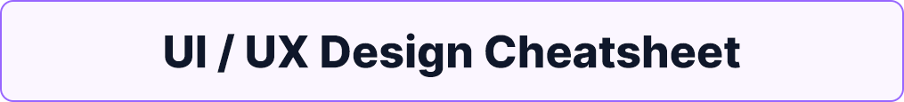

<a name="readme-top"></a>

<!-- PROJECT LOGO -->
<br />
<div align="center">
  <a href="#">
    
  </a>

  <h3 align="center">UI / UX Design Cheatsheet</h3>

  <p align="center">
    Tips, resources and guidance to help you develop application interfaces.
    <br />
    <a href="https://github.com/muresan-gabriel/ui-ux-design-cheatsheet"><strong>Explore the docs »</strong></a>
    <br />
    <br />
    <a href="https://github.com/muresan-gabriel/ui-ux-design-cheatsheet/blob/main/README-RO.md">Romanian</a>
    ·
    <a href="https://github.com/muresan-gabriel/ui-ux-design-cheatsheet/issues">Report a Problem</a>
    ·
    <a href="https://github.com/muresan-gabriel/ui-ux-design-cheatsheet/issues">Contribute</a>
    ·
    <a href="https://gabrielmuresan.site/blog/ui-ux">Live Page</a>
  </p>
</div>


<!-- TABLE OF CONTENTS -->
<details>
  <summary>Table of Contents</summary>
  <ol>
    <li>
      <a href="#about-the-project">About The Project</a>
    </li>
    <li>
      <a href="#basic-design-principles">Basic Design Principles</a>
      <ul>
        <li>
          <a href="#contrast">Contrast</a>
        </li>
        <li>
          <a href="#proportion">Proportion</a>
        </li>
        <li>
          <a href="#hierarchy">Hierarchy</a>
        </li>
        <li>
          <a href="#white-space">White-Space</a>
        </li>
        <li>
          <a href="#unity">Unity</a>
        </li>
      </ul>
    </li>
    <li>
      <a href="#general-tips">General Tips</a>
    </li>
    <li>
      <a href="#resources">Resources</a>
    </li>
  </ol>
</details>

<!-- ABOUT THE PROJECT -->

## About The Project

This repository was created with the purpose of assisting you with either tips or resources to create fantastic UIs.

* As a developer, your time should be dedicated towards programming and learning. Not all of us want to be designers, but sometimes we have to work on the visual part of the projects as well.
* UI is not just the looks of an application. UI includes UX. Every time a user interacts with your application, they should already be comfortable with your functionalities and know what each button is supposed to do.
* UI Design is NOT always font combinations, a good choice of color palette and advanced concepts and principles of art and design. Sometimes it's just CONSISTENCY.
* Overloading the UI with things you don't understand or don't know how to combine just yet is a bad practice. Constistency is easy to achieve and will bring immediate good results.
* Just like in development, you don't need to reinvent the wheel. Make use of available resources out there on the Internet. There are multiple FREE resources ready to be implemented in your projects. For example, we can make use of free icons available to us. They can take any form, from simple ```.svg``` / ```.png``` images, to HTML ```<i></i>``` elements from libraries of icons, such as <a href="https://fontawesome.com/icons">FontAwesome</a> or <a href="https://icons.getbootstrap.com/">BootstrapIcons</a>, to ```JSX``` components which you can copy to clipboard and paste in your projects.

### What to expect

This repository contains information and resources to help you create good UIs for your projects.

As I do not have any experience with applications outside of the web, I recommend you to stick to general tips and guidance and apply them to your projects in the way you find suitable. 

For example, for the UI of a desktop application, if you'd like to add an icon to a button, I suppose you'd save the image of the icon, add it to your project folder and use some kind of class methods to display that icon within the button.

You can use the Table of Contents to navigate to each section of interest.

Feel free to contribute with anything you think it's missing to help other developers or students.

<p align="right">(<a href="#readme-top">back to top</a>)</p>

<!-- BASIC DESIGN PRINCIPLES -->
## Basic Design Principles

### Contrast

Defined as the difference between elements within a design that makes them stand out from each other, contrast plays an important role in the visibility of each element. 

You should (almost) never put a blue text on a slightly lighter blue background. It affects the text's readability. 

Of course, you could bring the color of text closer to the background color to suggest that the text is secondary, informational and doesn't play a very important role in transmitting a message, but even it this situation, it should still be visible and readable for the user.

### Proportion

Refers to the size of the elements in relation to each other. Proportion and scale are important in hierarchy as well, as larger elements tend to appear more important.

Use proportion and scale in your advantage and define important elements, such as CTAs (Call to Actions) using scale, color, or shape.

### Hierarchy

We place elements accordingly based on levels of importance. You should also provide a visual solutions to this. A simple example would be making the title large (```24px```) in contrast to the paragraph of text (```12px```).

### White-Space

White-space is an important element in most designs. We can define empty spaces on a page on each side, left and right, and keep all the content in the center. For a blog post, this would allow the user to focus on the text, the most important element of an article, and it could be a solution to shorter lines of text, which are easier to follow.

For example, it's easier to read lines that are ```8-12``` words in length. We can easily follow to the next line and keep track of where we are in the article. It's harder to read text which has lines that are, for example, ```24-28``` words in length.

White space can also be a good separator between elements or clusters of elements (see <a href="#unity">Unity</a>).

### Unity

Defining clusters of elements that are related to each other offers a solid structure to your interface. For example, you should always stick all important elements related to navigation to the navbar / header menu, or, usually, you would keep the Login / Sign Up buttons together, not spread apart from each other.

__

These are 5 principles which I think you can easily apply to your projects for fast and clear improvements to the UI. There are 12 principles in total, and if you'd like to learn more about them, I strongly recommend to research the subject more in your free time.

All of these principles are:

1. Contrast
2. Balance
3. Emphasis
4. Proportion
5. Hierarchy
6. Repetition
7. Rhythm
8. Pattern
9. White space
10. Movement
11. Variety
12. Unity

<p align="right">(<a href="#readme-top">back to top</a>)</p>

<!-- GENERAL TIPS & TRICKS -->
## General Tips

### Keep things simple and consistent

This is one of the most important tip I can provide. Be consistent throughout your entire application. This refers to colors, fonts, sizes, shapes and more.

### Create a default look and feel for your application

* Choose a background color and stick to it.
* Choose a font-size for each element you think you'll have on your page, but limit yourself to a handful of different elements. Paragraphs of text should have a size of ```16px```. Apply these font-sizes consistently to your elements.
* Choose a few colors for your application. If you have an application which is heavily branded, your brand should have a set of colors (usually, at max, 3). Besides these colors, you should choose colors according to the elements of your application. If you have information alerts, depending on the type of alert, you'd want to use a specific color (e.g. red for danger, orange / yellow for warnings, green for success).
* If you have a set of brand colors in place for your project, choose the shade, tone and tint of the colors for your informational elements accordingly. If you have bold, intense colors for your brand, you'd want your red, green and yellow for your alerts to be just as bold. If you have a pastel, playful color palette for your brand, you'd want to use pastel green, red and yellow for your alerts as well.
* Besides defining a set of colors to use in your project, make sure to be consistent! Don't use a lighter shade of red or blue, use the exact same color, exact same ```RGB / HEX``` code.
* Your shapes should be just as consistent as your colors. If you're working on an application that you think would suit rounded corners, keep the value consistent throughout all elements. Don't enforce a button with a border-radius of ```25px``` and the parent container with a border-radius of ```20px```. Keep them the same.
* Use the same font everywhere. You need a good vision and a good understanding of typography to be able to combine fonts together. Use one type of font everywhere. Define the importance of the text based on size, and sometimes color, not based on the font. All of this text you're reading is displayed using ```Segoe UI```. GitHub stays consistent and uses the same font for messages, placeholder text in input elements or buttons. The only exception to this rule are markdown / code blocks. These are written using a monospace font called ```Consolas```.
* To further provide an example of consistency in GitHub, everything related to danger or aborting specific action is marked using red. The ```HEX``` value of this red is ```#DA3633```. The same blue is used in hyperlinks and the same green is used for CTAs or elements used in confirmation / submitting an action.
* Consistency can be found in size as well. Use the same size for buttons, the same border radius, and differentiate their importance by color. If the purpose of your application is to attract user registrations, which can make use of some free functionalities of your applications, later to be tempted to pay for access to more functionalities, you'd want to make your ```Sign Up``` button a CTA and have the ```Login``` button as a secondary option, next to the ```Sign Up```.
 
### Font recommendation

I suggest exploring <a href="https://fonts.google.com/">Google Fonts</a> and finding a font that fits your needs. It offers users the possibility of using ```imports``` in stylesheets or ```link``` elements to add to the ```head``` of your ```HTML``` document. You can also download an entire family or only specific font weights. Make sure to check the license before you use the font.

There are other websites to help you find good fonts, but I'd recommend sticking to Google Fonts, as they provide very good solutions for fast implementation of fonts in your projects.

I recommend implementing only ```2-3``` weights of a font family for your project. Stick to Regular and Bold / Extra-Bold / Black.

I also recommend, as mentioned before, to maintain consistency throughout your project. Use the same font size for paragraphs, the same font size for buttons (also the same heights / colors, depending of their use-case)

__

##### Personal font preferences

These choices are subjective and are fonts which I am familiar with and have used throughout various web projects. Consider taking this with a grain of salt.

* <a href="https://github.com/rsms/inter">Inter</a> - This is a fantastic font which was crafted and designed especially for computer screens. It's my go-to font for almost every project. See the <a href="https://fonts.google.com/specimen/Inter?query=inter">Google Fonts</a> page aswell.
* <a href="https://www.cufonfonts.com/font/segoe-ui-4">Segoe UI</a> - You're seeing it right now. GitHub uses Segoe UI by default. It should be available on any Windows OS version after Windows 7. I'm not sure about Linux distributions or MacOS, but you can download it for free from anywhere.
* <a href="https://fonts.google.com/specimen/Montserrat?query=montserr">Montserrat</a> - Fantastic font, loved by many.

These are a handful of fonts to use in your projects. Feel free to explore more. All of these are sans-serif fonts. I strongly recommend not opting for serif fonts, unless you have a specific reason to do so.

Either way, a good choice of serif fonts:

* <a href="https://fonts.google.com/specimen/Libre+Baskerville">Libre Baskerville</a> - Fantastic serif, usually a very good choice for blog posts and article bodies, or simply used in display headings.
* <a href="https://befonts.com/butler-font.html">Butler</a> - Very well crafted typeface for display and graphics.

### Visuals

Humans are lazy. All of us hate thinking too much when we try to achieve a simple thing. As a developer, you should ensure that your elements are easily recognizable. Offer users ways to understand instantly what they see.

You can easily achieve this with icons. Add icons to your buttons to send a better message across. Even a small arrow makes the difference. Proceed with care, as over-using icons can also break your UI. Find balance and be consistent.

If you know what you're doing and you planned ahead, make sure to use illustrations or other graphic elements. There are various platforms which offer free or cheap illustrations which can improve your landing or send a stronger message to the user. They're also pretty cool.

### "This UI looks great" - Me, to myself, or you, to yourself

Throughout experimenting with various designs and applications, I always get used to my UI. It looks good, but is it usable? Sometimes we need to let others test out what we build and ```*gasp*```, they'll tell us it's really bad. I tell friends or family to look over what I've done. Sometimes I provide them information, sometimes I just let them explore and see what they come up with. Many times I manage to observe thinks I didn't even think about.

The best tester to your application is somebody who has never seen your application before. Ask your friends for feedback on your design. If possible, let them test out your application, see how's the UX for them. Tell them to break it as well, maybe you have some security issues or your code simply doesn't work the way you want it to.

### Provide feedback to the user

You might think it makes absolute sense for the page of articles of a user to be completely empty if they haven't posted any articles, right? No, it shouldn't. Make sure to add placeholder text to offer additional information as to what is going on. The page is empty? Explain why it's empty. 

No search results? "Uh oh, couldn't find anything for ```How to become a god-like web developer and earn $160k / year```"

__

Sometimes the user just wants all the 905 records of available Pokémon, in one single page. Such a request is quite heavy and it will take a while until the client receives all of this data.

Another form of feedback is when the user is waiting to receive or see something. If you have a very heavy operation in your application which takes a long time to load or execute, make sure to provide the user a feedback to know that the application didn't freeze or break. A loading icon should do the job. 

### Anticipate mistakes

Users are *almost* all the time humans. And humans make mistakes. 

Make sure to prevent these mistakes before they happen. Disable the submit button while the user completes the form. As soon as they're done, enable it.

But somtimes we simply cannot prevent all mistakes. Atleast anticipate them and provide the user feedback to know what's gone wrong.

If they want to make their password ```verysecurepassword123```, tell them in an easy to understand way that you have configured the form validation to accept only passwords which are 12 characters long, must contain atleast a number, an uppercase character and a symbol.

Display a container below the password field as an error which mentions all of the above.

<p align="right">(<a href="#readme-top">back to top</a>)</p>

<!-- RESOURCES -->
## Resources

### Fonts

Most of these websites provide fonts for free, but some of them offer limited weights of the family or a large majority are paid. I will let you explore, but will leave a mention to each website if the fonts are paid.

* <a href="https://fonts.google.com/">Google Fonts</a> ```Open-Source```
  * Open-source fonts
  * Fantastic tools to easily implement fonts in your projects
  * Knowledge with additional information
* <a href="https://www.fontfabric.com/free-fonts/">FontFabric</a> ```Paid fonts, but some are free with limitations```
  * They offer very well crafted fonts
  * They have a Free Fonts category and list out families which are free to a certain extent
  
### Icons

There are various ways of implementing all of these libraries of fonts in your projects. Make sure to take a look at the documentation of the library you'd like to use.

* <a href="https://heroicons.com/">heroicons</a> - ```Open-Source```
  * Easy to copy to clipboard ```SVG``` / ```JSX```
  * Can also be installed via ```npm```, fantastic for ```React``` / ```Vue```
  * Figma file available to easily start out designing mock-ups or prototyping using these icons
  * Created by the team @ ```Tailwind CSS```
* <a href="https://fontawesome.com/">FontAwesome</a> - ```Free for Individuals```
  * 2000+ Free Icons to choose from
  * Easy to implement in any projects
* <a href="https://fonts.google.com/icons">Google Fonts - Icons</a> - ```Open-Source```
  * Just like fonts, they offer great tools for customization and implementation
  * They offer guidelines to developers
  * A Figma plugin can be used for prototyping
* <a href="https://icons.getbootstrap.com/">Bootstrap Icons</a> - ```Open-Source```
  * Easy to install and implement
  * Figma library
  * Very powerful together with the Bootstrap framework
